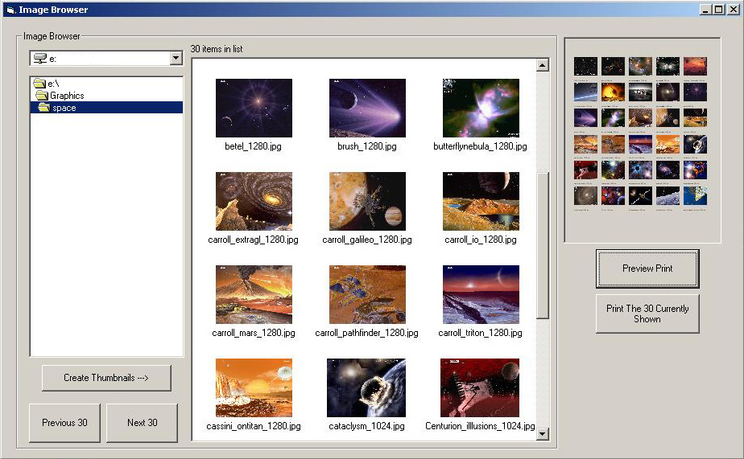



## Print Thumbnail Catalog

### Description

There are actually two progams included. One will create thumbnails of an entire directory, while the other one will create 30 thumbnails at a time. Both can present you with a preview of the print and then print the thumbnails. The code for browsing and creating the thumbnails came from PSC: http://www.planet-source-code.com/vb/scripts/ShowCode.asp?txtCodeId=31026&lngWId=1 and the code to preview then print the images came from Microsoft: Microsoft Knowledge Base Article - 193379. I just married the two and added a loop to the Microsoft code.
 
### More Info
 

             |
---                |---
**Submitted On**   |2003-12-30 10:20:42
**By**             |[R Lemming](https://github.com/Planet-Source-Code/PSCIndex/blob/master/ByAuthor/r-lemming.md)
**Level**          |Beginner
**User Rating**    |5.0 (10 globes from 2 users)
**Compatibility**  |VB 6\.0
**Category**       |[Graphics](https://github.com/Planet-Source-Code/PSCIndex/blob/master/ByCategory/graphics__1-46.md)
**World**          |[Visual Basic](https://github.com/Planet-Source-Code/PSCIndex/blob/master/ByWorld/visual-basic.md)
**Archive File**   |[Print\_Thum16885712312003\.zip](https://github.com/Planet-Source-Code/r-lemming-print-thumbnail-catalog__1-50690/archive/master.zip)

